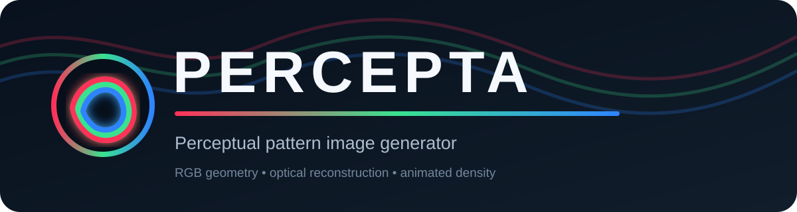
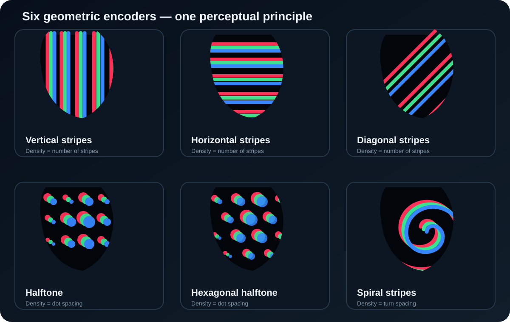
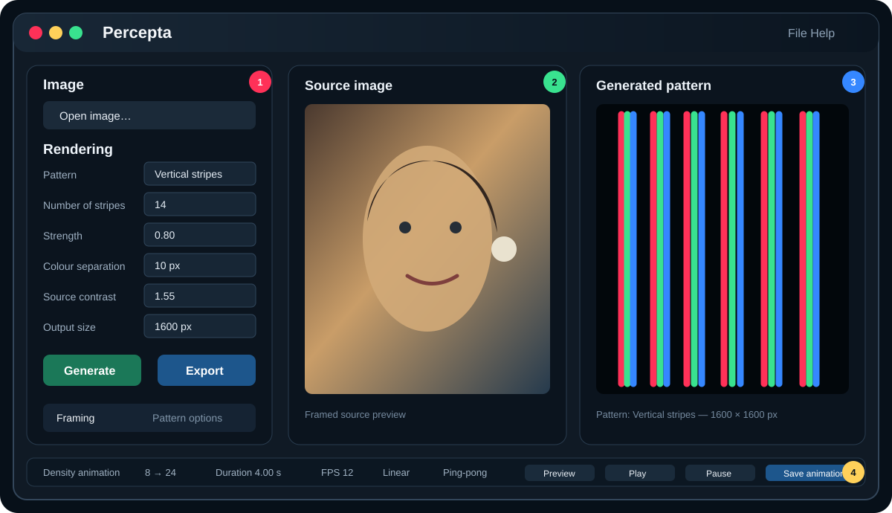
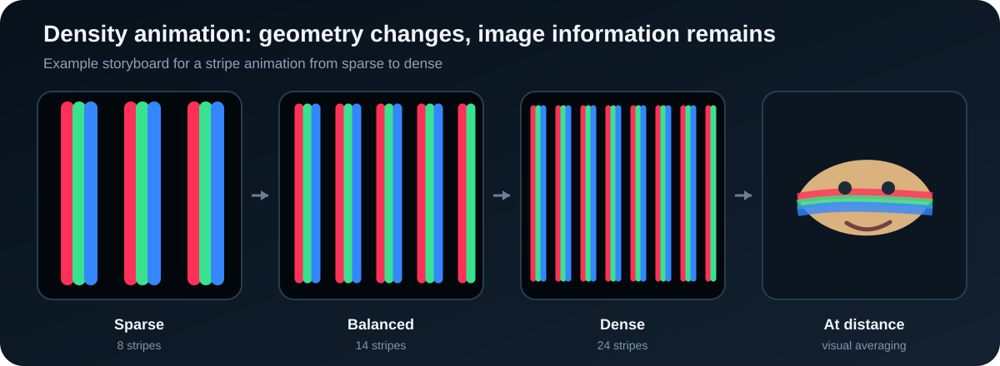

<p align="center">
  
</p>

<p align="center">
  <strong>Turn photographs into RGB stripes, halftones and spirals that reconstruct themselves at a distance.</strong>
</p>

<p align="center">
  <a href="#quick-start">Quick start</a> ·
  <a href="#rendering-modes">Rendering modes</a> ·
  <a href="#how-the-illusion-works">How it works</a> ·
  <a href="#installation">Installation</a> ·
  <a href="#documentation">Documentation</a>
</p>

---

## What is Percepta?

**Percepta** is a desktop image generator that converts a conventional picture into a geometric RGB pattern. Seen from nearby, the result is an abstract composition of coloured stripes, dots or a continuous spiral. Seen from farther away—or reduced on screen—the coloured structures are spatially averaged by the visual system and the source image reappears.

Percepta does not simply place a filter over the photograph. It analyses the red, green and blue information independently and encodes local channel intensity into geometry: stripe width, dot diameter or spiral thickness. The three structures are then combined additively. Their overlap produces white and secondary-colour fringes; their local average preserves the image information.

<p align="center">
  
</p>

### Highlights

- **Six complementary encoders:** vertical, horizontal and diagonal stripes; square-grid and hexagonal halftones; one continuous Archimedean spiral.
- **Independent RGB geometry:** red, green and blue channel content is carried by separate geometric masks rather than painted as ordinary pixels.
- **Interactive framing:** crop, zoom, horizontal and vertical pan, and rotation are applied before rendering.
- **Pattern-specific controls:** line smoothing, halftone shape and angle, minimum dot size, spiral centre, direction and path smoothing.
- **Density animation:** animate the principal sampling parameter between two values, with easing and optional ping-pong playback.
- **High-resolution output:** export still images for screen or print in PNG, TIFF, SVG or PDF form.
- **Adaptive defaults:** useful density values scale with output size so that a 3200 px export keeps approximately the same apparent structure as a 1600 px preview.

---

## Quick start

1. **Open a source image.** Use **Open image…** in the left panel.
2. **Choose a pattern.** Start with *Vertical stripes* or *Halftone* for a portrait, *Diagonal stripes* for architecture, or *Spiral stripes* for a more graphic result.
3. **Frame the image.** Select a crop, then use zoom, pan and rotation to place the subject.
4. **Set the density.** The meaning of this control follows the selected pattern: number of stripes, dot spacing, or spiral turn spacing.
5. **Tune the appearance.** Adjust **Strength**, **Colour separation** and **Source contrast**.
6. **Generate.** Inspect the result both at full size and as a small thumbnail. The illusion is judged best after zooming out.
7. **Export.** Choose a raster or vector format appropriate for display, printing or further editing.

<p align="center">
  
</p>

The interface is organised around four functional areas:

1. **Input and rendering controls** — image loading, pattern choice and global parameters.
2. **Source preview** — the image after the current crop and framing transformation.
3. **Generated preview** — the encoded pattern at the selected settings.
4. **Density animation strip** — start and end values, timing, playback and export.

---

## Rendering modes

### Vertical stripes

The image is sampled along a set of vertical carriers. Local red, green and blue values modulate the visible width of the corresponding RGB components. Vertical stripes work especially well with portraits and subjects whose important contours are not predominantly vertical.

- **Density control:** number of stripes.
- **Reference default at 1600 px:** 14 stripes.
- **Typical animation:** 8 → 24 stripes.
- **Visual character:** bold, poster-like, easy to recognise at moderate distance.

### Horizontal stripes

The same encoding principle is rotated by 90°. Horizontal carriers often preserve eye lines, horizons and broad lateral tonal transitions particularly well.

- **Density control:** number of stripes.
- **Reference default at 1600 px:** 14 stripes.
- **Typical animation:** 8 → 24 stripes.
- **Visual character:** calm, scan-line-like, well suited to wide compositions.

### Diagonal stripes

The sampling axis is rotated. This reduces direct alignment with purely horizontal or vertical subject features and often creates a more dynamic result.

- **Density control:** number of stripes.
- **Reference default at 1600 px:** 18 stripes.
- **Typical animation:** 10 → 28 stripes.
- **Visual character:** energetic, graphic and effective for architecture or angular subjects.

### Halftone

A regular two-dimensional grid replaces lines with RGB dots. The diameter of each channel’s dot is derived from local intensity. Large dots represent strong channel contribution; small or absent dots represent weak contribution.

- **Density control:** centre-to-centre dot spacing in pixels.
- **Reference default at 1600 px:** 12 px.
- **Typical animation:** 24 px → 7 px.
- **Visual character:** printed-screen aesthetic with good local detail.

### Hexagonal halftone

Rows are offset to form a triangular/hexagonal lattice. Each sample has six equidistant neighbours, producing a more isotropic visual texture than a square grid.

- **Density control:** nearest-neighbour dot spacing in pixels.
- **Reference default at 1600 px:** 12 px.
- **Typical animation:** 24 px → 7 px.
- **Visual character:** compact, organic and less axis-biased than square halftone.

### Spiral stripes

A single continuous Archimedean spiral runs from the selected centre to the image boundary. Its local RGB thickness is modulated by the source image. The result combines continuity, radial motion and coloured fringes.

- **Density control:** spacing between successive turns in pixels.
- **Reference default at 1600 px:** 19 px.
- **Typical animation:** 24 px → 6 px.
- **Additional controls:** centre X/Y, clockwise or counter-clockwise direction, path smoothing.
- **Visual character:** strongly recognisable as an artwork at close range and particularly striking during animation.

---

## Global controls

| Control | What it changes | Practical effect |
|---|---|---|
| **Density** | Sampling frequency or spacing | Controls the balance between visible geometry and reconstructed detail. |
| **Strength** | Amplitude of intensity-to-geometry modulation | Low values make the pattern more uniform; high values increase tonal differentiation. |
| **Colour separation** | Relative displacement of the RGB structures | Adds red/cyan, green/magenta and blue/yellow fringes. Excessive separation reduces distant reconstruction. |
| **Source contrast** | Contrast of the image before encoding | Clarifies a flat image but can clip highlights and shadows when pushed too far. |
| **Output size** | Final width/height in pixels | Determines export resolution and drives adaptive density defaults. |

The visible reference settings used in the supplied examples are **Strength 0.80**, **Colour separation 10 px**, **Source contrast 1.55** and **Output size 1600 px**. They are a useful starting point, not mandatory optimum values.

### Framing

The **Framing** tab changes the source before it is encoded:

- **Crop** selects the target aspect ratio.
- **Zoom** enlarges the source within the selected crop.
- **Pan X / Pan Y** moves the subject without changing scale.
- **Rotation** straightens or deliberately tilts the composition.
- **Reset** restores neutral framing.

Framing matters more than it might in an ordinary image filter: the pattern has limited spatial bandwidth, so a clearly placed subject usually reconstructs more convincingly than a distant, cluttered scene.

### Pattern options

Controls in **Pattern options** depend on the active renderer.

- **Lines:** smoothing reduces stair-stepping and harsh local width changes.
- **Halftone:** dot shape, screen angle and minimum size alter both texture and small-signal visibility.
- **Spiral:** centre X/Y repositions the origin, direction reverses winding, and smoothing regulates abrupt thickness changes along the path.

---

## Density animation

Percepta can animate the parameter that chiefly controls geometric scale. For stripes, the number of carriers changes. For halftones and spirals, spacing changes.

<p align="center">
  
</p>

The animation panel provides:

- start and end parameter values;
- duration;
- frames per second;
- easing/interpolation mode;
- optional ping-pong playback;
- preview, play, pause, stop and save controls.

A useful animation starts with geometry large enough to be immediately visible, then moves toward a denser state in which the source becomes increasingly easy to read. Ping-pong playback turns this into a continuous alternation between abstraction and reconstruction.

---

## How the illusion works

A digital image normally assigns one RGB triplet to every pixel. Percepta instead redistributes that colour information into local geometric coverage.

For a channel value close to zero, little of that channel is drawn. For a high value, a wider stripe, larger dot or thicker spiral segment is drawn. If a small neighbourhood is viewed from far enough away, the eye no longer resolves every coloured edge independently. Optical blur, retinal sampling and neural spatial filtering average the neighbourhood. Its average red, green and blue contributions then approach those of the original image.

This explains the characteristic two-scale appearance:

- **near view:** discrete pattern, coloured fringes and construction method;
- **far view or thumbnail:** source image, tone and colour relationships;
- **intermediate view:** both readings coexist.

The effect depends on output size, physical print size, display pixel density, viewing distance, pattern density and the observer’s vision. There is therefore no single universally optimal setting. Percepta exposes the parameters that control this trade-off.

---

## Export and viewing

### Formats

- **PNG** — lossless raster output for general use and the web.
- **TIFF** — high-resolution raster master for print or archival workflows.
- **SVG** — scalable vector output where the active renderer supports vector geometry.
- **PDF** — convenient vector or print-ready document output.

### Practical recommendations

- Generate a **1600 px** preview while exploring, then export at **3000–5000 px** for a substantial print.
- Judge reconstruction at several zoom levels. A 15–25% screen zoom is often more informative than inspecting individual pixels.
- For printing, make a small proof first. Paper, ink spread and printer screening can alter thin RGB elements.
- Avoid heavy JPEG compression after export; ringing and chroma subsampling can damage narrow coloured structures.
- Keep colour management consistent. A display or printer with clipped RGB primaries reduces the intended channel balance.
- When Colour separation is high, increase viewing distance or density to recover integration.

---

## Installation

Percepta is designed as a Python desktop application and can also be distributed as a packaged Windows executable.

### Python environment

Recommended baseline:

- Python 3.10 or newer;
- PyQt6;
- NumPy;
- Pillow;
- imageio;
- imageio-ffmpeg for animation export.

```bash
python -m venv .venv
```

Activate the environment on Windows:

```powershell
.venv\Scripts\Activate.ps1
```

Install the dependencies:

```bash
python -m pip install --upgrade pip
python -m pip install PyQt6 numpy Pillow imageio imageio-ffmpeg
```

Run Percepta from the project directory:

```bash
python main.py
```

The packaged launcher can check required components at first start and install missing runtime dependencies. Subsequent starts use the stored component state for faster loading.

---

## Troubleshooting

**The image is difficult to recognise.**  
Reduce colour separation, increase source contrast moderately, use a denser pattern, simplify the crop, or view the output from farther away.

**The result looks almost white.**  
Strength may be too high, the source may be overexposed, or channel elements may overlap excessively. Lower Strength or Source contrast.

**The pattern dominates completely.**  
Increase stripe count or decrease dot/turn spacing. Also test a smaller on-screen zoom.

**Fine details disappear.**  
That is an inherent consequence of geometric resampling. Increase output resolution and pattern density, but remember that making the structure too fine can weaken the close-range artistic effect.

**An animation is too heavy to export.**  
Reduce output size, duration or FPS. Frame count is approximately duration × FPS, and every frame must be rendered and encoded.

---

## Documentation

The accompanying [**Percepta Technical Manual**](Percepta_Technical_Manual.pdf) develops the complete processing pipeline, mathematical model, individual rendering algorithms, adaptive defaults, perception theory, animation equations, export guidance and limitations.

Files prepared for distribution:

- `README.md` — project overview and user-facing guide;
- `Percepta_Technical_Manual.pdf` — illustrated technical reference;
- `docs/assets/` — reusable vector illustrations.

---

## Author and contact

**Virgile Adam**  
IBS — CNRS — Université Grenoble Alpes  
[virgile.adam@ibs.fr](mailto:virgile.adam@ibs.fr)  
[www.virgile-adam.com](https://www.virgile-adam.com)  
[GitHub / Percepta](https://github.com/VirgileAdam/Percepta)

© 2026 Virgile Adam. All rights reserved unless a separate licence file states otherwise.
